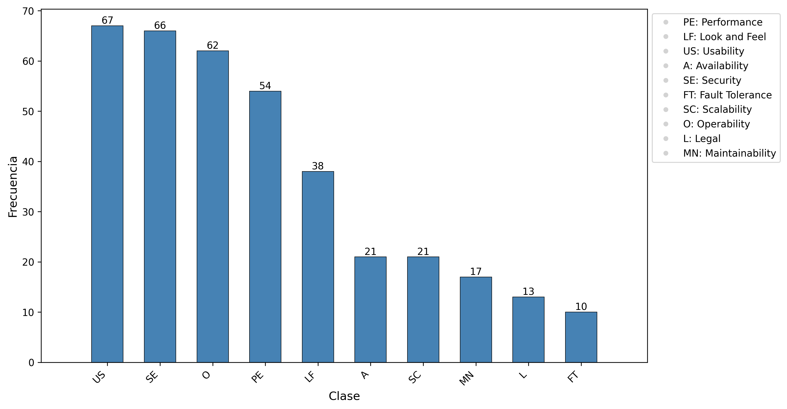

# Transfer Learning for Non-Functional Requirements Classification: The Influence of Sequence Length on Performance for Spanish and Portuguese Requirements

This project focuses on the classification of software requirements using a PROMISE dataset. The goal is to categorize non-functional requirements into 10 classes. The original dataset comprises a total of 625 natural language requirements, of which 255 are classified as functional and 370 as non-functional, further sub-divided into various quality categories.

## Prerequisites

To run the project, you need to have **Python 3.9 or higher** installed. For execute web application, you also need to have **Node.js 20 or higher**.

## Dataset
**_PROMISE:_** The quantitative distribution of requirements across these selected classes is illustrated in the figure below. 



For analysis in other languages, we translated these instances into Spanish and Portuguese, generating the `PROMISE-SP` and `PROMISE-PT` datasets, respectively. These datasets were used to train language-specific models, allowing us to assess their generalizability in less explored languages. Labels were assigned to consistent numerical identifiers across all languages to facilitate direct comparison of metrics.

## Execution

To execute the training and evaluation experiments for three languages:

1. Download the datasets from the [releases](https://github.com/i-am-sergio/NFR-classification/releases/tag/dataset) section of this repository.
2. Install the required dependencies using pip:
   ```bash
   pip install -r requirements.txt
   ```
3. For DL models, run colab or execute python file of `experiments/deep_learning/` folder. Remember change the name of dataset in the code to execute the experiment for each language only if necessary.

4. For ML models, review python files of `experiments/machine_learning/` folder

5. For web application, run the following commands:
   - For backend: 

   ```bash
   cd backend
   pip install -r requirements.txt
   python app.py
   ```
   - For frontend:
   ```bash
   cd frontend
   npm install
   npm run dev
   ```
