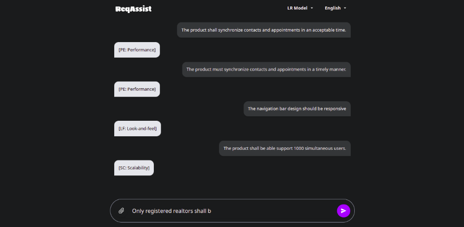

# ReqAssist

Es una aplicacion que permite usar los modelos entrenados de ML para la clasificacion de requisitos de software. Puedes introducir un requisito o subir un archivo con una lista de requisitos

### Modo Prompt
Ingresar la palabra: `clasifica:` seguido del requisito de software. Ejemplo:
```md
clasifica: El sistema debe soportar el manejo de mas de 50 usuarios al mismo tiempo 
```

### Execution
